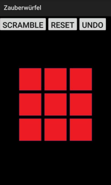
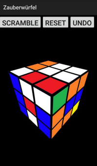

# Magic Cube Android App

Eine virtuelle 3×3×3 Rubiks‑Würfel‑App (Magic Cube) für Android, entwickelt mit OpenGL ES 2.0. Unterstützt alle physischen Würfelbewegungen sowie zusätzliche Funktionen wie Schrittweises Rückgängigmachen und automatisches Vermischen (Scramble).

---

## Funktionen

- **Komplette Würfelrotation** per Ziehgesten
- **Layerrotation** (±90°) durch Berühren und Wischen auf den Würfelseiten
- **Automatisches Vermischen** (zufällige Layer-Drehungen)
- **Schrittweises Rückgängigmachen** vorheriger Züge
- **Kompletter Reset** zurück zum gelösten Zustand

## Screenshots

  


## Erste Schritte

### Voraussetzungen

- Android Studio Bumblebee 2021.1.1 Patch 3 (inklusive Android SDK & OpenJDK)
- Android-Gerät/API ≥ 21 (Android 5.0) oder Emulator (z. B. Pixel 4 API 31)
- OpenGL ES 2.0-Unterstützung (mindestens API 8)

### Installation

1. **Repository klonen**:
   ```bash
   git clone https://github.com/joltzen/Bachelor-Thesis---A-Magic-Cube-application-under-Android-with-OpenGL-ES.git
   cd Bachelor-Thesis---A-Magic-Cube-application-under-Android-with-OpenGL-ES
   ```
2. **In Android Studio öffnen**:
   - „Open an existing Android Studio project“ auswählen
   - Verzeichnis dieses Repos als Projektwurzel festlegen
3. **Build & Run**:
   - Gerät oder Emulator auswählen
   - Auf ▶️ Run klicken

## Architektur

- **MainActivity**
  - Initialisiert GLSurfaceView, Toolbar-Buttons und Touch-Listener
  - Erstellt 27 Cubelets (Bitmaps → 3D-Matrix)
- **GLRendererJO** (_erweitert `GLRendererCV`_)
  - Ray-Casting zur Erkennung angeklickter Flächen oder Leerraum
  - Unterscheidung zwischen gesamter Würfel- und Layer-Rotation
- **RubiksCube**
  - Verwaltung der Permutationsindizes der Cubelets
  - Berechnung, welche Indizes zu welchem Layer gehören
- **Moves**
  - Kapselt einen einzelnen Layer-Rotationsschritt für Undo
- **GLShapeJO** (_erweitert `GLShapeCV`_) & **GLAnimatorFactoryJO**
  - Pro-Cubelet-Rotationszustände (24 Orientierungszustände)
  - Dual-Animator: Kreisbahn um den Würfelmittelpunkt + Spin pro Cubelet

Siehe das UML-Klassendiagramm in `docs/class_diagram.png` für eine visuelle Übersicht.

## Projektstruktur

```
app/
 ├─ src/
 │   ├─ main/
 │   │   ├─ java/…
 │   │   │   ├─ MainActivity.java
 │   │   │   ├─ GLRendererJO.java
 │   │   │   ├─ RubiksCube.java
 │   │   │   ├─ Moves.java
 │   │   │   ├─ GLShapeJO.java
 │   │   │   └─ GLAnimatorFactoryJO.java
 │   │   └─ res/
 │   │       ├─ layout/activity_main.xml
 │   │       └─ drawable/ (Bitmaps für die Würfelflächen)
 └─ build.gradle
```

## Lizenz

Dieses Projekt steht unter der MIT License. Siehe [LICENSE](LICENSE) für Details.
